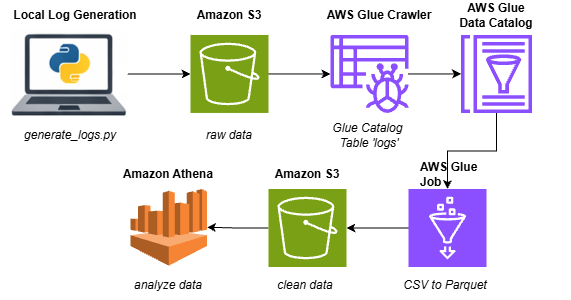
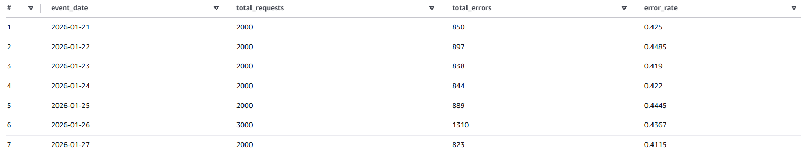

# MHA_PP1 – AWS Log Analytics ETL Pipeline

This projects implements a small, production style batch data engineering ETL pipeline. Synthetic  web log data is ingested as CSV into Amazon S3, tranformed into Parquet using AWS Glue, and queried using Amazon Athena

# Author: 
### Muhammad Hassan Asghar

## Goal

The goal of the project is to demonstrate:
- Raw vs clean data lake design
- Schema discovery with AWS Glue Crawlers
- CSV → Parquet conversion using Glue ETL jobs
- Query performance and cost differences between CSV and Parquet in Athena

## Architecture



- Data generation script:
  - [`src/generate_logs.py`](src/generate_logs.py)
- Glue ETL job script (CSV → Parquet):
  - [`infra/mha_pp1_csv_to_parquet.py`](infra/mha_pp1_csv_to_parquet.py)
- Glue Catalog and crawler setup (CLI commands):
  - [`infra/glue_catalog_setup.md`](infra/glue_catalog_setup.md)

## 📊 Example Output: Daily System Health Metrics

The pipeline produces a curated **Gold analytics layer** derived from raw web logs.
Below is an example output generated from the `logs_daily_endpoint_metrics` table in Athena.



**What this shows**
- Daily request volume aggregated from raw logs
- Daily error counts and error rate
- Metrics computed from a partitioned Parquet clean layer (`event_date`-partitioned)

This table is produced by an end-to-end pipeline:
Raw CSV logs → Typed & partitioned Parquet → Daily aggregated metrics.


## Data Flow

1. Synthetic web log data is generated locally using Python [script](src/generate_logs.py).
2. CSV files are uploaded to the S3 raw bucket under the `logs/` prefix.
3. A Glue Crawler scans the raw data and creates a table in the Glue Data Catalog.
4. A Glue ETL job reads the raw CSV table and writes Parquet files to the clean bucket.
5. A second Glue Crawler registers the clean Parquet data as a separate table.
6. Athena is used to query both raw and clean tables for comparison.

## Tech Stack

- AWS S3 – data lake storage (raw and clean zones)
- AWS Glue – schema discovery (crawlers) and ETL processing
- AWS Glue Data Catalog – centralized metadata store
- Amazon Athena – SQL-based analytics on S3 data
- Python – synthetic log data generation
- AWS CLI – command line interaction

## Query Examples & Results

Example query used on both raw (CSV) and clean (Parquet) tables:

```sql
SELECT COUNT(*) FROM mha_pp1_db.logs;
SELECT COUNT(*) FROM mha_pp1_db.clean_logs;
```

Observed Athena scan sizes:
- CSV (raw table): ~52 KB scanned
- Parquet (clean table): ~4 KB scanned


## How to Reproduce

Prerequisites:
- AWS account
- IAM user with permissions for S3, Glue, Athena
- AWS CLI configured
- Python 3.14.2

High-level steps:
1. Generate log data locally.
2. Upload data to S3 raw bucket.
3. Run Glue crawlers and ETL job.
4. Query data using Athena.


