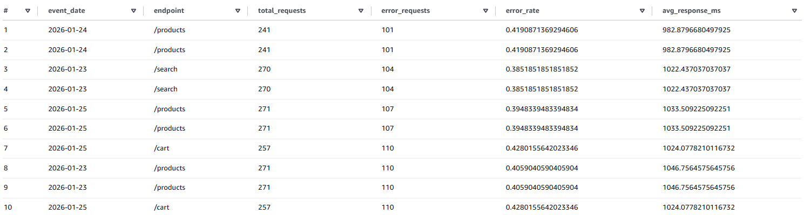

# MHA_PP1 – AWS Batch ETL Pipeline (Bronze–Silver–Gold)
### Author: Muhammad Hassan Asghar

This project demonstrates a **production-style batch ETL pipeline on AWS**, implemented incrementally and mostly using **AWS Glue Studio (Visual Jobs)**. The pipeline ingests synthetic web logs, cleans and optimizes them for analytics, and produces daily aggregated metrics suitable for downstream BI tools.

The design intentionally mirrors real-world data engineering patterns (Bronze → Silver → Gold) and focuses on **schema correctness, partitioning, incremental processing, and query performance**.

---

## Goal

The goal of the project is to demonstrate:
- Raw vs clean data lake design
- Schema discovery with AWS Glue Crawlers
- CSV → Parquet conversion using Glue ETL jobs
- Query performance and cost differences between CSV and Parquet in Athena

## Architecture Overview

End-to-end batch ETL pipeline on AWS using S3, Glue (Crawler + Jobs), Data Catalog, and Athena.


- Data generation script:
  - [`src/generate_logs.py`](src/generate_logs.py)
- Glue ETL job script (CSV → Parquet):
  - [`infra/mha_pp1_csv_to_parquet.py`](infra/mha_pp1_csv_to_parquet.py)
- Glue Catalog and crawler setup (CLI commands):
  - [`infra/glue_catalog_setup.md`](infra/glue_catalog_setup.md)
- Glue job parameters:
  - [`infra/glue_job_parameters.md`](infra/glue_job_parameters.md)


---

## Data Model

### Raw Input (Synthetic Web Logs)

Each log record represents a single HTTP request:

| Column        | Type      | Description                          |
|--------------|-----------|--------------------------------------|
| event_time   | timestamp | Request timestamp                    |
| user_id      | string    | User identifier                      |
| endpoint     | string    | Requested endpoint                   |
| status_code  | int       | HTTP response code                   |
| response_ms  | bigint    | Response latency (milliseconds)      |
| user_agent   | string    | Client type (desktop/mobile/tablet)  |

Synthetic logs are generated daily using a Python script and uploaded as CSV files.

---

## Bronze Layer – Raw Ingestion

**Purpose:**

- Preserve raw data exactly as received
- Enable replay and debugging

**Implementation:**

- CSV files stored in Amazon S3
- AWS Glue Crawler registers the `logs` table in the Data Catalog

No transformations are applied at this stage.

---

## Silver Layer – Clean & Optimized Logs

**Purpose:**

- Enforce a clean, typed schema
- Optimize storage and query performance
- Enable incremental processing

This approach reflects common production batch pipelines where data arrives incrementally and historical data must remain immutable.

**Implementation:**

- AWS Glue Studio **Visual Job**
- Source: `logs` (Bronze)
- Output: `logs_clean_v2`

**Key Features:**

- Conversion from CSV → **Parquet**
- Explicit data types (timestamps, integers)
- Derived `event_date` column
- **Partitioning by `event_date`**
- **Glue job bookmarks** for incremental loads


This layer provides clean dataset used by downstream tools.

---

## Gold Layer – Daily Endpoint Metrics

**Purpose:**

- Produce analytics-ready KPIs
- Minimize query cost and complexity

**Implementation:**

- AWS Glue Studio **Visual Job**
- Source: `logs_clean_v2` (Silver)

### Transform Logic

The Gold job uses **two aggregation branches**:

1. **All Requests**
   - Group by `event_date`, `endpoint`
   - Metrics:
     - `total_requests`
     - `avg_response_ms`
     - `max_response_ms`

2. **Error Requests Only**
   - Filter: `status_code >= 400`
   - Group by `event_date`, `endpoint`
   - Metric:
     - `error_requests`

The two streams are **LEFT JOINed** on `(event_date, endpoint)` to ensure endpoints with zero errors are preserved.

A derived column computes:

```
error_rate = error_requests / total_requests
```


### Gold Output Schema

| Column            | Type    | Description          |
|-------------------|---------|----------------------|
| endpoint          | string  | API endpoint         |
| total_requests    | bigint  | Total daily requests |
| error_requests    | bigint  | Daily error requests |
| error_rate        | double  | Error ratio          |
| avg_response_ms   | double  | Average latency      |
| max_response_ms   | bigint  | Maximum latency      |
| event_date        | date    | Partition key        |

**Storage & Catalog:**

- Parquet format (Snappy compression)
- Partitioned by `event_date`
- Registered as `logs_daily_endpoint_metrics`

---

## Incremental Processing

Both Silver and Gold jobs use **Glue job bookmarks**, ensuring:

- Only new input files / partitions are processed
- Existing data is never re-scanned
- Jobs remain fast and cost-efficient as data grows

This mimics production batch pipelines where data arrives continuously.

---

## Query Example (Athena)

```sql
SELECT event_date,
       endpoint,
       total_requests,
       error_rate,
       avg_response_ms
FROM logs_daily_endpoint_metrics
ORDER BY event_date, endpoint;
```


## 📊 Example Output: Daily System Health Metrics

The pipeline produces a curated **Gold analytics layer** derived from raw web logs.
Below is an example output generated from the `logs_daily_endpoint_metrics` table in Athena.



**What this shows**
- Daily request volume aggregated from raw logs
- Daily error counts and error rate
- Metrics computed from a partitioned Parquet clean layer (`event_date`-partitioned)

This table is produced by an end-to-end pipeline:
Raw CSV logs → Typed & partitioned Parquet → Daily aggregated metrics.


## Tech Stack

- AWS S3 – data lake storage (raw and clean zones)
- AWS Glue – schema discovery (crawlers) and ETL processing
- AWS Glue Data Catalog – centralized metadata store
- Amazon Athena – SQL-based analytics on S3 data
- Python – synthetic log data generation
- AWS CLI – command line interaction


## How to Reproduce

Prerequisites:
- AWS account
- IAM user with permissions for S3, Glue, Athena
- AWS CLI configured
- Python 3.14.2

High-level steps:
1. Generate log data locally.
2. Upload data to S3 raw bucket.
3. Run Glue crawlers and ETL job.
4. Query data using Athena.


